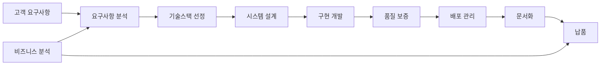

# 🚀 프리랜서 개발자를 위한 프로덕션 서비스 개발 에이전트 시스템

## 📋 시스템 개요
1인 프리랜서 개발자가 고객의 요구사항을 받아 프로덕션 레벨의 서비스를 개발하고 납품하기 위한 체계적인 에이전트 시스템

---

## 🤖 서브에이전트 구성

### 1. 📊 요구사항 분석 에이전트 (Requirements Analyst)
**역할**: 고객의 요청을 체계적으로 분석하여 명확한 기술 명세로 변환

**수행 작업**:
- 비즈니스 요구사항을 기술 요구사항으로 변환
- 기능/비기능 요구사항 분류 및 우선순위 설정
- 유저 스토리 및 유스케이스 작성
- 제약사항 및 리스크 식별
- MVP 범위 정의

**산출물**:
- 요구사항 명세서 (SRS)
- 유저 스토리 맵
- 리스크 평가서
- MVP 기능 목록

---

### 2. 🛠 기술스택 선정 에이전트 (Tech Stack Architect)
**역할**: 프로젝트 요구사항에 최적화된 최신 기술스택 선정

**수행 작업**:
- 프로젝트 특성 분석 (규모, 트래픽, 데이터량)
- 최신 기술 트렌드 및 생태계 안정성 평가
- 개발 속도 vs 성능 vs 유지보수성 균형점 찾기
- 클라우드 서비스 및 SaaS 선정
- 라이선스 및 비용 검토

**추천 기술스택 (2024-2025)**:

**프론트엔드**:
- **웹앱**: Next.js 15 + TypeScript + Tailwind CSS v4
- **모바일**: React Native / Flutter 3
- **상태관리**: Zustand / TanStack Query
- **UI 라이브러리**: Shadcn/ui, Radix UI

**백엔드**:
- **API**: Node.js (Bun/Deno) / Python FastAPI / Go Fiber
- **데이터베이스**: PostgreSQL + Drizzle ORM / Prisma
- **캐싱**: Redis / Upstash
- **실시간**: Socket.io / WebSocket

**인프라/DevOps**:
- **호스팅**: Vercel / Railway / Fly.io
- **데이터베이스**: Supabase / Neon / PlanetScale
- **스토리지**: Cloudflare R2 / AWS S3
- **모니터링**: Sentry / Posthog

---

### 3. 🏗 시스템 설계 에이전트 (System Designer)
**역할**: 확장 가능하고 유지보수가 쉬운 시스템 아키텍처 설계

**수행 작업**:
- 마이크로서비스 vs 모놀리식 결정
- 데이터베이스 스키마 설계 (정규화, 인덱싱)
- API 설계 (REST/GraphQL/tRPC)
- 인증/인가 시스템 설계
- 캐싱 전략 수립
- 확장성 계획 (수평/수직 확장)

**산출물**:
- 시스템 아키텍처 다이어그램
- ERD (Entity Relationship Diagram)
- API 명세서 (OpenAPI/Swagger)
- 시퀀스 다이어그램
- 인프라 구성도

---

### 4. 💻 구현 개발 에이전트 (Implementation Developer)
**역할**: 클린 코드와 베스트 프랙티스를 적용한 실제 구현

**수행 작업**:
- 프로젝트 초기 설정 (보일러플레이트, 린팅, 포매팅)
- 모듈화된 컴포넌트 개발
- 비즈니스 로직 구현
- 데이터베이스 연동 및 최적화
- 서드파티 서비스 통합
- 에러 핸들링 및 로깅

**코딩 원칙**:
- DRY (Don't Repeat Yourself)
- SOLID 원칙
- Clean Architecture
- Test-Driven Development
- Code Review 체크리스트

---

### 5. 🧪 품질 보증 에이전트 (QA Engineer)
**역할**: 버그 없는 안정적인 서비스 보장

**수행 작업**:
- 단위 테스트 작성 (Jest, Vitest)
- 통합 테스트 구현
- E2E 테스트 시나리오 (Playwright, Cypress)
- 성능 테스트 (Lighthouse, K6)
- 보안 취약점 검사
- 접근성 검사 (WCAG 2.1)

**품질 지표**:
- 코드 커버리지 > 80%
- Lighthouse 점수 > 90
- 응답 시간 < 200ms
- 에러율 < 0.1%

---

### 6. 🚢 배포 관리 에이전트 (DevOps Engineer)
**역할**: 안전하고 효율적인 배포 파이프라인 구축

**수행 작업**:
- CI/CD 파이프라인 구성 (GitHub Actions)
- 도커 컨테이너화
- 환경별 설정 관리 (개발/스테이징/프로덕션)
- 자동 배포 및 롤백 전략
- 모니터링 및 알림 설정
- 백업 및 재해 복구 계획

**배포 체크리스트**:
- [ ] 환경변수 설정
- [ ] 데이터베이스 마이그레이션
- [ ] SSL 인증서
- [ ] CDN 설정
- [ ] 도메인 연결
- [ ] 모니터링 대시보드

---

### 7. 📚 문서화 에이전트 (Documentation Writer)
**역할**: 명확하고 유지보수가 쉬운 문서 작성

**수행 작업**:
- README.md 작성
- API 문서 생성 (Swagger UI)
- 사용자 가이드 작성
- 개발자 온보딩 문서
- 트러블슈팅 가이드
- 변경 로그 관리

**문서 구조**:
```
docs/
├── getting-started/
├── api-reference/
├── user-guide/
├── deployment/
├── troubleshooting/
└── changelog/
```

---

### 8. 💰 비즈니스 분석 에이전트 (Business Analyst)
**역할**: 프로젝트 비용 산정 및 ROI 분석

**수행 작업**:
- 개발 공수 산정 (기능 포인트 분석)
- 인프라 비용 계산
- 유지보수 비용 예측
- 라이선스 비용 검토
- ROI 및 손익분기점 분석
- 계약서 및 견적서 작성

**비용 구조**:
- 개발비: 기능 복잡도 × 시간당 단가
- 인프라비: 월간 고정비 + 사용량 기반
- 유지보수비: 개발비의 15-20% (연간)
- 라이선스비: 서드파티 서비스 비용

---

## 🔄 에이전트 협업 워크플로우



---

## 📊 프로젝트 단계별 에이전트 활용

### Phase 1: 분석 (1-2주)
- 요구사항 분석 에이전트 (주도)
- 비즈니스 분석 에이전트
- 기술스택 선정 에이전트

### Phase 2: 설계 (1주)
- 시스템 설계 에이전트 (주도)
- 기술스택 선정 에이전트

### Phase 3: 개발 (4-8주)
- 구현 개발 에이전트 (주도)
- 품질 보증 에이전트

### Phase 4: 테스트 (1-2주)
- 품질 보증 에이전트 (주도)
- 구현 개발 에이전트

### Phase 5: 배포 (3-5일)
- 배포 관리 에이전트 (주도)
- 문서화 에이전트

### Phase 6: 유지보수
- 모든 에이전트 (필요시)

---

## 🎯 성공 지표 (KPI)

1. **개발 효율성**
   - 예상 공수 대비 실제 공수: ±10% 이내
   - 재작업률: < 5%

2. **품질 지표**
   - 프로덕션 버그 발생률: < 1%
   - 고객 만족도: > 90%

3. **비즈니스 지표**
   - 납기 준수율: 100%
   - 수익성: 목표 마진 달성

---

## 🛡 리스크 관리

### 기술적 리스크
- 신기술 도입 시 학습 곡선
- 서드파티 서비스 의존성
- 확장성 병목 현상

### 비즈니스 리스크
- 요구사항 변경 (스코프 크리프)
- 예산 초과
- 납기 지연

### 대응 전략
- 애자일 방법론 적용
- 단계별 검증 및 피드백
- 버퍼 시간 확보 (20%)
- 명확한 계약서 작성

---

## 🚀 실행 가이드

### 1단계: 프로젝트 킥오프
```bash
# 프로젝트 초기화
npx create-next-app@latest [project-name] --typescript --tailwind --app
cd [project-name]

# 필수 패키지 설치
npm install @supabase/supabase-js lucide-react sonner
npm install -D @types/node prettier eslint-config-prettier
```

### 2단계: 환경 설정
```bash
# .env.local 생성
echo "NEXT_PUBLIC_API_URL=" >> .env.local
echo "DATABASE_URL=" >> .env.local
```

### 3단계: 개발 시작
```bash
# 개발 서버 실행
npm run dev

# 타입 체크
npm run type-check

# 린트 검사
npm run lint
```

### 4단계: 배포
```bash
# 프로덕션 빌드
npm run build

# Vercel 배포
vercel --prod
```

---

## 📞 커뮤니케이션 프로토콜

### 고객과의 소통
- **주간 보고**: 진행 상황, 이슈, 다음 주 계획
- **데모 세션**: 2주마다 작동하는 프로토타입 시연
- **긴급 이슈**: 즉시 보고 및 해결 방안 제시

### 문서 공유
- GitHub 프로젝트 보드
- Notion 협업 페이지
- Figma 디자인 시스템

---

## 🎓 지속적 개선

### 학습 리소스
- 최신 기술 트렌드 모니터링
- 온라인 코스 및 인증
- 오픈소스 기여

### 피드백 루프
- 프로젝트 회고 (Retrospective)
- 고객 피드백 수집
- 코드 리뷰 및 개선

---

## 💡 프로 팁

1. **고객 기대치 관리**: 언더프로미스, 오버딜리버
2. **버전 관리**: Git Flow 또는 GitHub Flow 준수
3. **보안 우선**: OWASP Top 10 체크리스트
4. **성능 최적화**: 처음부터 고려, 나중에 개선
5. **확장성 설계**: 10x 성장 가능한 아키텍처

---

이 에이전트 시스템을 활용하면 1인 프리랜서도 대규모 팀 수준의 프로덕션 퀄리티를 달성할 수 있습니다! 🚀